# Evoveo Smart Reporter

An intelligent test reporter with AI-powered failure analysis, flakiness detection, performance regression alerts, and a modern interactive dashboard. Free and open source (Apache-2.0) — every feature included.

**Works with any automation technology** — Playwright (native), plus JUnit XML, TRX, and Postman/Newman results via the `generate` CLI. One report format for your entire test estate.


*Dashboard with quality gates, quarantine, suite health grade, attention alerts, and failure clusters*

### One reporter, every framework

| Playwright | Cypress | .NET (TRX) | Postman | Selenium | SoapUI |
|------------|---------|------------|---------|----------|--------|
|  |  |  |  |  |  |

<details>
<summary><b>Framework screenshots</b> (click to expand)</summary>

#### Cypress (JUnit XML)
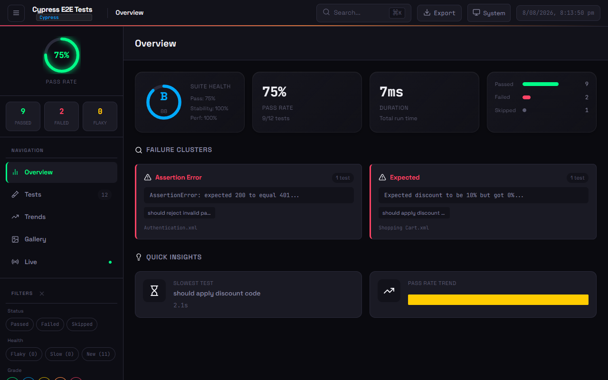
*Cypress E2E test results — 12 tests across Auth, Cart, and API suites*
Example: [`examples/multi-framework/cypress-junit.xml`](examples/multi-framework/cypress-junit.xml)

#### .NET / MSTest (TRX)
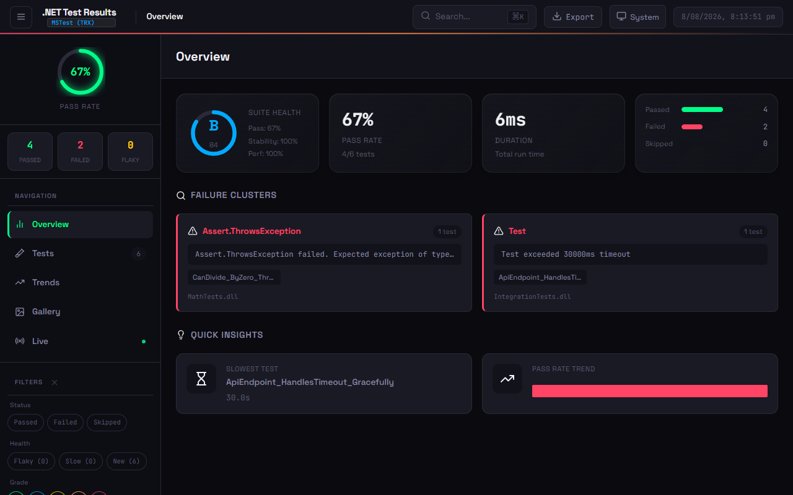
*.NET test results via `dotnet test --logger trx` — MSTest, xUnit, NUnit, RestSharp*
Example: [`examples/multi-framework/dotnet-trx.trx`](examples/multi-framework/dotnet-trx.trx)

#### Postman / Newman (JSON)
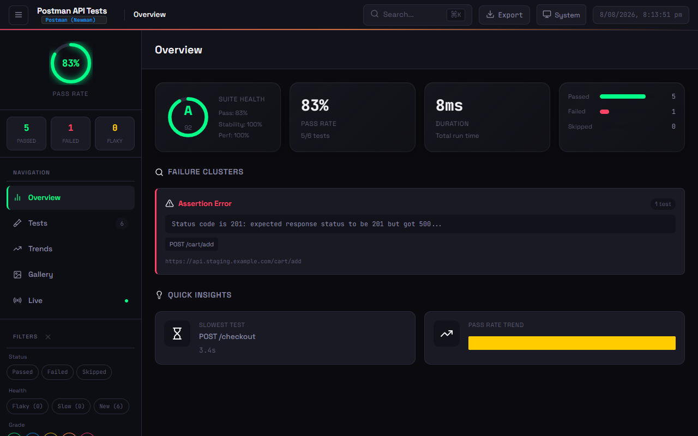
*Postman/Newman API collection results — 6 requests with assertion-level pass/fail*
Example: [`examples/multi-framework/postman-newman.json`](examples/multi-framework/postman-newman.json)

#### Selenium (Generic JSON)
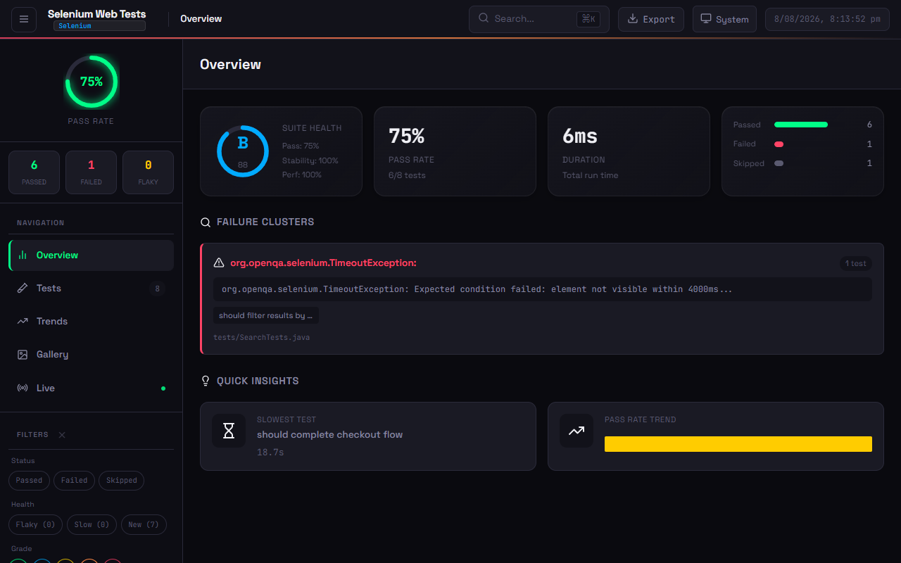
*Selenium WebDriver test results — 8 tests across Login, Navigation, Search, Cart, Checkout*
Example: [`examples/multi-framework/selenium-generic.json`](examples/multi-framework/selenium-generic.json)

#### SoapUI (JUnit XML)
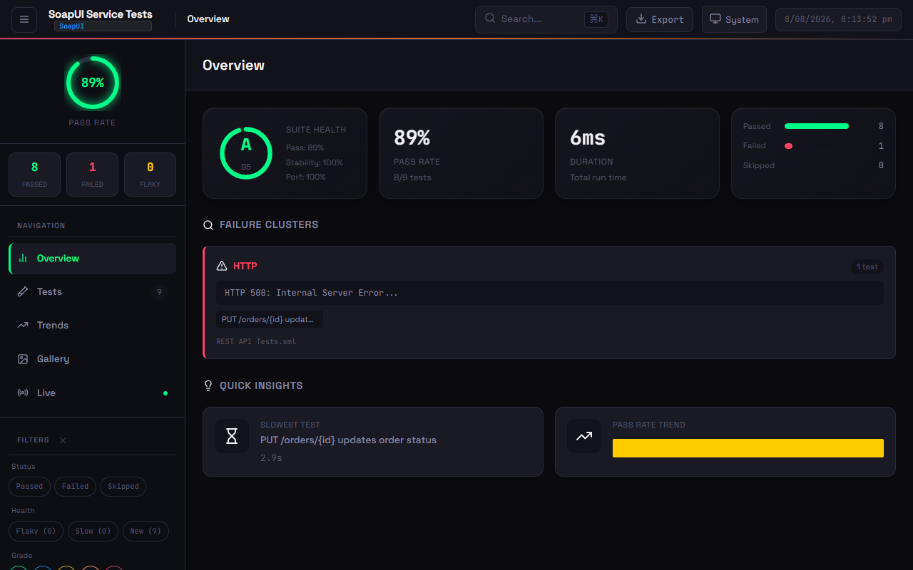
*SoapUI service test results — 9 tests across SOAP, REST, and Security suites*
Example: [`examples/multi-framework/soapui-junit.xml`](examples/multi-framework/soapui-junit.xml)

</details>

---

## Installation

```bash
npm install -D evoveo-smart-reporter
```

## Quick Start

Add to your `playwright.config.ts`:

```typescript
import { defineConfig } from '@playwright/test';

export default defineConfig({
  reporter: [
    ['evoveo-smart-reporter', {
      outputFile: 'smart-report.html',
      historyFile: 'test-history.json',
      maxHistoryRuns: 10,
    }],
  ],
});
```

Run your tests and open the generated `smart-report.html`.

## Multi-Framework Support (CLI)

The `generate` CLI produces the same rich report from **any** automation technology's result file. Format is auto-detected.

```bash
npx evoveo-smart-reporter generate --input <results-file> [options]
```

| Format | Flag | Covers |
|--------|------|--------|
| JUnit XML | `--format junit` | Cypress, Selenium, Jest, Vitest, Pytest, Go, Maven, TestNG, SoapUI, WebdriverIO |
| TRX | `--format trx` | MSTest, xUnit, NUnit (.NET) |
| Newman JSON | `--format newman` | Postman / Newman API collections |
| Generic JSON | `--format json` | Any framework — convert to the schema |
| Auto-detect | `--format auto` (default) | Detects from file content and extension |

<details>
<summary><b>CLI examples</b> (click to expand)</summary>

```bash
# Cypress (emits JUnit XML)
npx evoveo-smart-reporter generate --input cypress-results.xml --framework "Cypress"

# .NET / RestSharp (MSTest TRX)
npx evoveo-smart-reporter generate --input TestResults.trx --framework "RestSharp Integration" --export-pdf

# Postman / Newman
npx evoveo-smart-reporter generate --input newman-report.json --format newman

# SoapUI (JUnit XML export)
npx evoveo-smart-reporter generate --input soapui-junit.xml --framework "SoapUI" --title "API Regression"

# Selenium (generic JSON)
npx evoveo-smart-reporter generate --input selenium-results.json --format json --framework "Selenium"

# Any framework — convert to the generic JSON schema
npx evoveo-smart-reporter generate --input my-results.json --format json --framework "Custom Runner"
```

Generate all example reports and screenshots: `node scripts/generate-examples.js`

</details>

<details>
<summary><b>CLI options for <code>generate</code></b> (click to expand)</summary>

| Option | Description |
|--------|-------------|
| `--input <path>` | Path to the test result file (required) |
| `--format <format>` | Input format: `auto`, `junit`, `trx`, `newman`, `json` (default: `auto`) |
| `--output <path>` | Output HTML report path (default: `smart-report.html`) |
| `--history <path>` | History file path (default: `test-history.json`) |
| `--framework <name>` | Override the framework label shown in the report header |
| `--project <name>` | Project name (separates history per project) |
| `--export-json` | Also write `smart-report-data.json` |
| `--export-junit` | Also write JUnit XML |
| `--export-pdf` | Also generate PDF executive summaries |
| `--theme <preset>` | Theme preset (`default`, `dark`, `light`, `high-contrast`, ...) |
| `--title <title>` | Report title (branding) |

</details>

<details>
<summary><b>Programmatic API</b> (click to expand)</summary>

```typescript
import { detectAdapter, getAdapter } from 'evoveo-smart-reporter/adapters';
import { ReportGenerator } from 'evoveo-smart-reporter/report-generator';
import * as fs from 'fs';

const content = fs.readFileSync('results.xml', 'utf-8');
const adapter = detectAdapter(content, 'results.xml'); // or getAdapter('junit')
const ingested = adapter!.ingest({ content, outputDir: '.', options: {} });

const generator = new ReportGenerator({
  options: { outputFile: 'report.html' },
  outputDir: '.',
});
generator.ingest(ingested);
await generator.generate();
```

</details>

---

## Leadership Dashboard — Test Intelligence Platform

Aggregate test runs across your entire enterprise — multiple clients, products, teams, and stacks — into one leadership dashboard. See pass rates, flakiness, and trends by team. Drill down to the single-run report you already know.

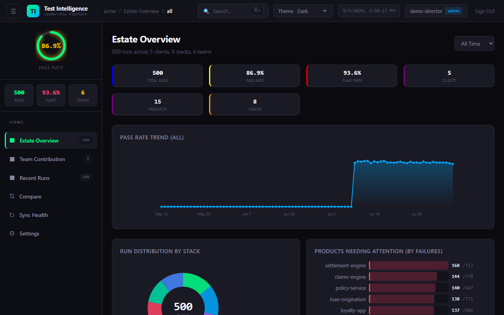
*Estate overview: 500 runs across 5 clients, 6 teams, 8 stacks — pass rate ring, KPI cards, trend chart*

### Quick Start

```bash
npm run build
node dist/bin/seed-data.js --data-dir ./data    # seed 500 sample runs
npx evoveo-smart-reporter-dashboard --port 3000 --data-dir ./data
# Open http://localhost:3000
```

### Views

| View | What it shows |
|------|---------------|
| **Estate Overview** | KPI cards (pass rate, flaky rate, total runs), trend chart, heatmaps by client/product/team/stack |
| **Team Contribution** | Tests authored + fixes landed per team (from GitHub/Jira connectors), worst runs, flaky tests |
| **Recent Runs** | Run list with client, product, team, stack, pass rate, duration — click to drill down |
| **Period Comparison** | Current period vs previous period — are things getting better or worse? |
| **Sync Health** | CI pipeline connector status — is the dashboard data complete and current? |
| **Settings** | Cloud storage (OneDrive/Google Drive), alert thresholds, connector config |

<details>
<summary><b>Dashboard screenshots</b> (click to expand)</summary>

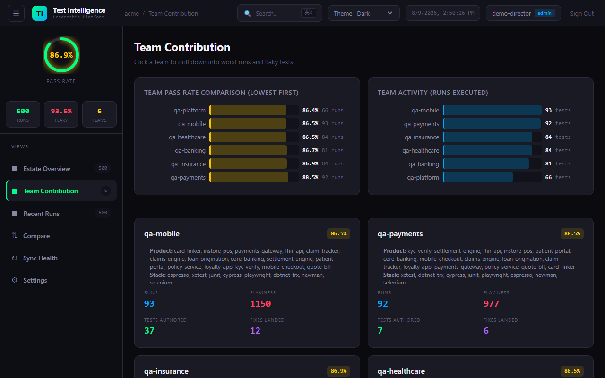
*Team contribution: tests authored and fixes landed per team, with drill-down*

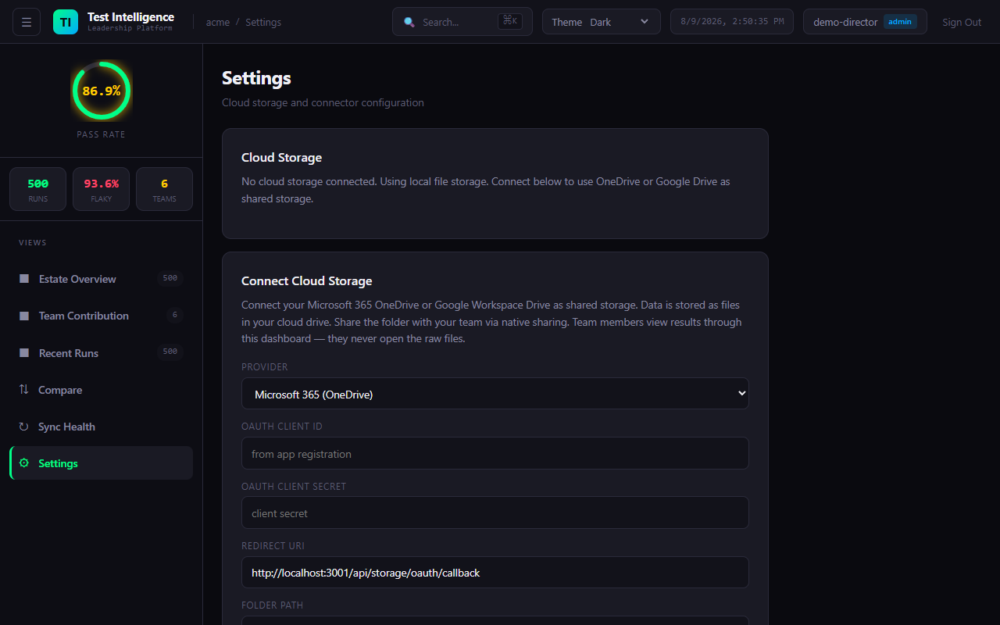
*Settings: connect OneDrive or Google Drive as shared storage — no Docker, no Postgres*

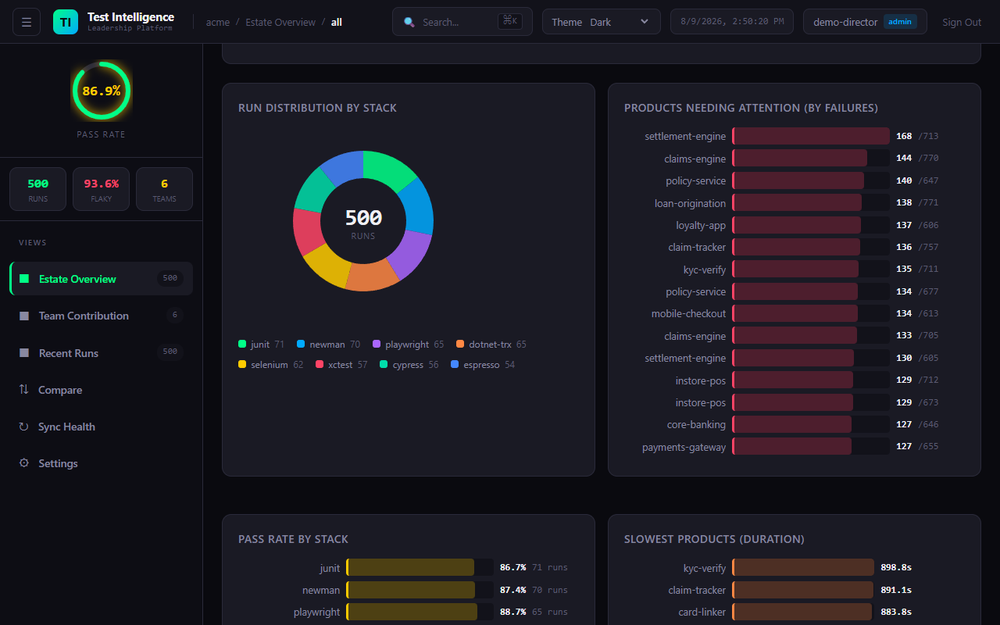
*Estate trend: pass rate and flaky rate over time with distribution heatmaps*

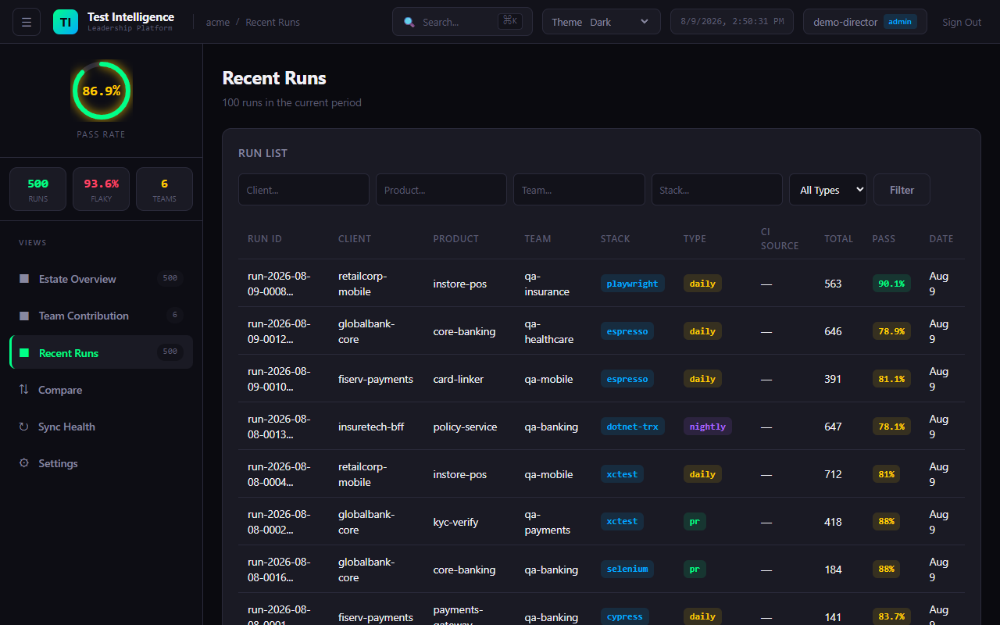
*Recent runs: client, product, team, stack, pass rate, duration — click to drill down*

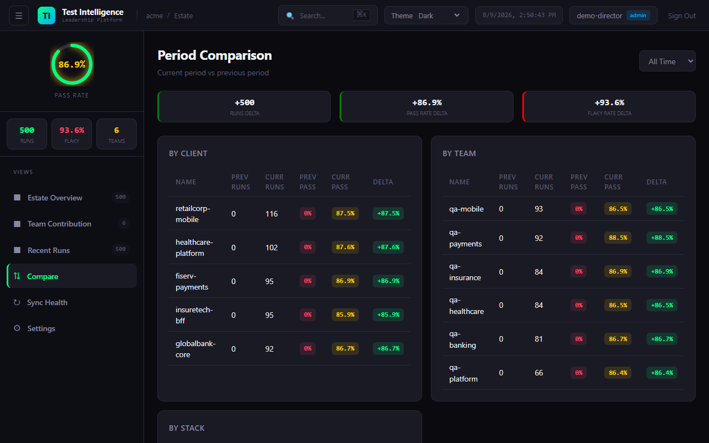
*Period comparison: current vs previous period — pass rate delta, flaky rate delta*

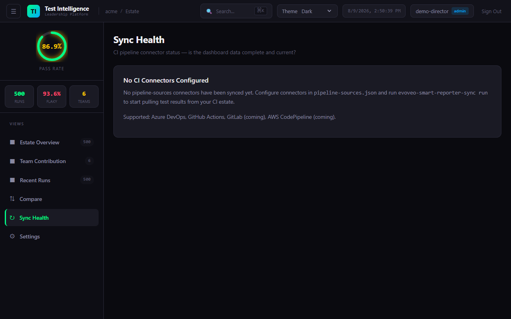
*Sync health: CI pipeline connector status — last sync, stale warnings*

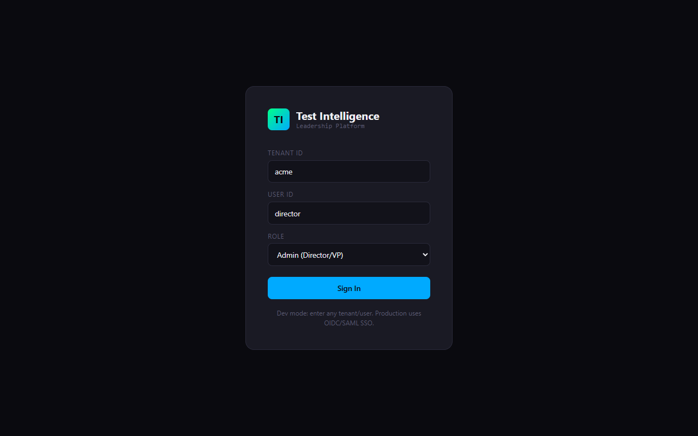
*Dev mode login — enter any tenant/user. Production uses OIDC or SAML SSO.*

</details>

### Auth Modes

| Mode | Flag | Use Case |
|------|------|----------|
| Dev | `--auth dev` | Local development (login form, trusts headers) |
| OIDC | `--auth oidc --oidc-url <url>` | Enterprise SSO (Keycloak, Okta, Google) |
| SAML | `--auth saml` | SAML via gateway delegation (mod_auth_mellon, Shibboleth) |

### Ingesting Runs

```bash
curl -X POST http://localhost:3000/api/ingest \
  -H 'Content-Type: application/json' \
  -H 'X-Tenant-Id: acme' -H 'X-User-Id: u1' -H 'X-User-Role: admin' \
  -d '{
    "orgContext": {
      "tenantId": "acme", "client": "fiserv-payments", "product": "payments-gateway",
      "team": "qa-payments", "stack": "junit", "runType": "nightly", "environment": "ci"
    },
    "format": "junit",
    "rawArtifact": "<testsuites><testsuite name=\"s\" tests=\"10\" failures=\"1\"><testcase name=\"ok\"/><testcase name=\"bad\"><failure>boom</failure></testcase></testsuite></testsuites>"
  }'
```

**Full guide:** [`docs/leadership-dashboard-guide.md`](docs/leadership-dashboard-guide.md) · **ADRs:** [`docs/adr/`](docs/adr/) (9 ADRs)

---

## Features

### Core Analysis
- **AI Failure Analysis** — fix suggestions via your own Anthropic, OpenAI, or Gemini API key
- **Flakiness Detection** — historical tracking across runs (not single-run retries)
- **Performance Regression Alerts** — warns when tests get significantly slower
- **Stability Scoring** — composite health metrics (0-100, grades A–F)
- **Failure Clustering** — group similar failures by error type with AI analysis
- **Test Retry Analysis** — track tests that frequently need retries

### Interactive Dashboard
- **Sidebar Navigation** — Overview, Tests, Trends, Comparison, Gallery views
- **10 themes** + fully custom theme colours (Ocean, Sunset, Dracula, Cyberpunk, Forest, Rose, and more)
- **Keyboard Shortcuts** — `1-5` switch views, `j/k` navigate tests, `f` search, `e` export
- **Virtual Scroll** — pagination for large test suites (500+ tests)

<details>
<summary><b>Feature screenshots</b> (click to expand)</summary>


*Expanded test card with step timeline, network logs, run history, and quarantine badge*


*Interactive trend charts with pass rate, duration, flaky tests, and slow test tracking*


*Visual grid of screenshots, videos, and trace files*


*Test list with status badges, stability grades, quarantine indicators, and filtering*


*Run comparison showing new failures, performance changes, and baseline diffs*

</details>

### Flakiness Detection

Tracks flakiness **across runs**, not within a single run:

| | Playwright HTML Report | Evoveo Smart Reporter |
|---|---|---|
| **Scope** | Single test run | Historical across multiple runs |
| **Criteria** | Fails then passes on retry | Failed 30%+ of the time historically |
| **Use Case** | Immediate retry success | Chronically unreliable tests |

Indicators: **Stable** (<10% failure) — **Unstable** (10-30%) — **Flaky** (>30%) — **New** (no history)

### Stability Grades

Composite score (0-100): Flakiness (40%) + Performance (30%) + Reliability (30%).
Grades: **A** (90-100), **B** (80-89), **C** (70-79), **D** (60-69), **F** (<60). All configurable.

---

## Configuration

<details>
<summary><b>Full options reference</b> (click to expand)</summary>

```typescript
reporter: [
  ['evoveo-smart-reporter', {
    // Core
    outputFile: 'smart-report.html',
    historyFile: 'test-history.json',
    maxHistoryRuns: 10,
    performanceThreshold: 0.2,

    // Notifications
    slackWebhook: process.env.SLACK_WEBHOOK_URL,
    teamsWebhook: process.env.TEAMS_WEBHOOK_URL,

    // Feature flags (all default to true unless noted)
    enableRetryAnalysis: true,
    enableFailureClustering: true,
    enableStabilityScore: true,
    enableGalleryView: true,
    enableComparison: true,
    enableAIRecommendations: true,
    enableTrendsView: true,
    enableTraceViewer: true,
    enableHistoryDrilldown: false,
    enableAISuiteHealth: true,      // AI health summary (uses 1 AI request)
    enableNetworkLogs: true,

    // Step and path options
    filterPwApiSteps: false,
    relativeToCwd: false,

    // Multi-project
    projectName: 'ui-tests',
    runId: process.env.GITHUB_RUN_ID,

    // Network logging
    networkLogFilter: 'api.example.com',
    networkLogExcludeAssets: true,
    networkLogMaxEntries: 50,

    // Thresholds
    stabilityThreshold: 70,
    retryFailureThreshold: 3,
    baselineRunId: 'main-branch-baseline',
    thresholds: {
      flakinessStable: 0.1, flakinessUnstable: 0.3, performanceRegression: 0.2,
      stabilityWeightFlakiness: 0.4, stabilityWeightPerformance: 0.3, stabilityWeightReliability: 0.3,
      gradeA: 90, gradeB: 80, gradeC: 70, gradeD: 60,
    },

    // Report customisation & exports
    theme: { preset: 'default' },  // default, light, dark, high-contrast, ocean, sunset, dracula, cyberpunk, forest, rose
    exportPdf: false, exportJson: false, exportJunit: false,
    qualityGates: {},           // { minPassRate, maxFlakyRate, minStabilityGrade }
    quarantine: {},             // { enabled, outputFile, threshold }
    branding: {},               // { logo, title, footer, hidePoweredBy }

    // Advanced
    cspSafe: false,
    maxEmbeddedSize: 5 * 1024 * 1024,
  }],
]
```

</details>

### AI Analysis

Set one environment variable — costs are billed by your provider (uses small, fast models with short prompts):

```bash
export ANTHROPIC_API_KEY=your-key    # Claude (used first if multiple are set)
export OPENAI_API_KEY=your-key       # OpenAI
export GEMINI_API_KEY=your-key       # Google Gemini
```

If no API key is set, AI analysis is skipped. Every failed test still gets a **Copy AI Prompt** button for use with any AI assistant.

<details>
<summary><b>Feature configuration examples</b> (click to expand)</summary>

#### Themes
```typescript
reporter: [['evoveo-smart-reporter', {
  theme: { preset: 'dracula' },  // ocean, sunset, dracula, cyberpunk, forest, rose
}]]
```

#### Executive PDF Export
```typescript
reporter: [['evoveo-smart-reporter', { exportPdf: true }]]
```
Generates PDF reports in 3 variants: Corporate, Minimal, Dark.

#### Quality Gates
```typescript
reporter: [['evoveo-smart-reporter', {
  qualityGates: { minPassRate: 95, maxFlakyRate: 5, minStabilityGrade: 'B' },
}]]
```
Or as a standalone CLI: `npx evoveo-smart-reporter gate --min-pass-rate 95 --max-flaky-rate 5`
Exit codes: `0` = passed, `1` = gate failed (use in CI to block deploys).

#### Flaky Test Quarantine
```typescript
reporter: [['evoveo-smart-reporter', {
  quarantine: { enabled: true, outputFile: '.smart-quarantine.json', threshold: 0.3 },
}]]
```

#### Custom Branding
```typescript
reporter: [['evoveo-smart-reporter', {
  branding: { title: 'Acme Corp Test Report', footer: 'Generated by QA Team' },
  theme: { primary: '#6366f1', accent: '#8b5cf6', success: '#22c55e', error: '#ef4444', warning: '#f59e0b' },
}]]
```

#### JSON & JUnit Export
```typescript
reporter: [['evoveo-smart-reporter', { exportJson: true, exportJunit: true }]]
```

#### Step Filtering
```typescript
reporter: [['evoveo-smart-reporter', { filterPwApiSteps: true }]]
```
Hides verbose `page.click()`, `page.fill()` steps — only named `test.step()` entries appear.

#### Multi-Project History
```typescript
reporter: [['evoveo-smart-reporter', {
  projectName: 'api',
  historyFile: 'reports/{project}/history.json',
}]]
```

</details>

---

## CI Integration

History must persist between runs for flakiness detection and trends to work.

### CI Auto-Detection

The reporter automatically detects GitHub Actions, GitLab CI, CircleCI, Jenkins, Azure DevOps, and Buildkite. Branch, commit SHA, and build ID are displayed in the report header.

### Quality Gates in CI

```yaml
# GitHub Actions example
- run: npx playwright test
  continue-on-error: true
- run: npx evoveo-smart-reporter gate --min-pass-rate 95 --max-flaky-rate 5
  # Exits non-zero if gates fail — blocks the pipeline
```

### Sharded Runs

Set `runId` for consistent history across parallel shards:
```typescript
reporter: [['evoveo-smart-reporter', { runId: process.env.GITHUB_RUN_ID }]]
```

Merge history from multiple machines:
```bash
npx evoveo-smart-reporter-merge-history shard1/test-history.json shard2/test-history.json -o merged-history.json --max-runs 10
```

<details>
<summary><b>CI cache examples</b> — GitHub Actions, GitLab, CircleCI, Azure DevOps (click to expand)</summary>

#### GitHub Actions
```yaml
- uses: actions/cache@v4
  with:
    path: test-history.json
    key: test-history-${{ github.ref }}
    restore-keys: test-history-
- run: npx playwright test
- uses: actions/cache/save@v4
  if: always()
  with:
    path: test-history.json
    key: test-history-${{ github.ref }}-${{ github.run_id }}
```

#### GitLab CI
```yaml
test:
  cache:
    key: test-history-$CI_COMMIT_REF_SLUG
    paths: [test-history.json]
    policy: pull-push
  script: npx playwright test
```

#### CircleCI
```yaml
- restore_cache:
    keys: [test-history-{{ .Branch }}, test-history-]
- run: npx playwright test
- save_cache:
    key: test-history-{{ .Branch }}-{{ .Revision }}
    paths: [test-history.json]
```

#### Azure DevOps
```yaml
steps:
  - task: Cache@2
    inputs:
      key: 'test-history | "$(Build.SourceBranchName)"'
      restoreKeys: 'test-history |'
      path: test-history.json
  - script: npx playwright test
    continueOnError: true
  - task: PublishPipelineArtifact@1
    inputs:
      targetPath: smart-report.html
      artifact: playwright-smart-report
    condition: always()
```

</details>

---

## Trace Viewer & Network Logs

**Inline Viewer:** Click **View** on any test with traces — film strip, actions panel, before/after screenshots, network waterfall, console messages, errors.

**Local Server:** `npx evoveo-smart-reporter-serve smart-report.html` — serves with full trace viewer support (no `file://` CORS issues).

**CLI Viewer:** `npx evoveo-smart-reporter-view-trace ./traces/my-test-trace-0.zip`

**Network Logs:** Automatically extracted from Playwright trace files. Requires tracing enabled:
```typescript
use: { trace: 'retain-on-failure' }  // or 'on'
```

## Annotations

| `@slow` | `@fixme`/`@fix` | `@skip` | `@issue`/`@bug` | `@todo` | `@flaky` | `@fail` | Custom |
|---------|-----------------|---------|------------------|---------|----------|--------|--------|
| Amber | Pink | Indigo | Red | Blue | Orange | Red | Grey |

```typescript
test('payment flow', async ({ page }) => {
  test.slow();
  test.info().annotations.push({ type: 'issue', description: 'JIRA-123' });
});
```

## CSP-Safe Mode

For environments with strict Content Security Policy (e.g., Jenkins):
```typescript
reporter: [['evoveo-smart-reporter', { cspSafe: true }]]
```
Generates companion `.css` and `.js` files instead of inline tags. System fonts used instead of Google Fonts.

## Cucumber Integration

Works with Playwright + Cucumber frameworks:
```typescript
import { defineBddConfig } from 'playwright-bdd';
const testDir = defineBddConfig({ features: 'features/**/*.feature', steps: 'steps/**/*.ts' });
export default defineConfig({ testDir, reporter: [['evoveo-smart-reporter']] });
```

---

## FAQ & Troubleshooting

<details>
<summary><b>Common questions and issues</b> (click to expand)</summary>

**Is this really free?** Yes. Everything is Apache-2.0-licensed — no tiers, no license keys. AI analysis is the only feature with an external cost (billed by your provider via your own API key).

**RangeError with large test suites?** Fixed in v1.0.6. Update: `npm install evoveo-smart-reporter@latest`

**Different flakiness than Playwright's HTML report?** They use different methodologies — see [Flakiness Detection](#flakiness-detection) above.

**Report too large or browser hangs?** Enable `cspSafe: true` to save attachments as files, or reduce `maxHistoryRuns`. Use `maxEmbeddedSize` to control the inline trace threshold.

| Problem | Cause | Fix |
|---|---|---|
| No history data | History file missing or wrong path | Check `historyFile` path, use CI caching |
| No network logs | Tracing not enabled | Add `trace: 'retain-on-failure'` to config |
| No AI suggestions | No AI API key set | Set `ANTHROPIC_API_KEY`, `OPENAI_API_KEY`, or `GEMINI_API_KEY` |
| Mixed project metrics | Shared history file | Use `projectName` to isolate |
| Quality gate not failing CI | Gate not run as separate step | Run `npx evoveo-smart-reporter gate` as its own CI step |

</details>

---

## QA Spec Kit — AI-Powered QA with Loop Engineering

This repo doubles as a **QA Spec Kit** — 72 AI agent skills + the Loop Engineering methodology that helps any AI IDE write better tests, debug faster, and ship with confidence.

**Works with:** Claude Code, GitHub Copilot, Cursor, Windsurf, Devin, and any IDE that reads `AGENTS.md`.

```powershell
# Windows
pwsh scripts/setup-agents.ps1 -Project
```
```bash
# macOS / Linux
bash scripts/setup-agents.sh --project
```

**Full setup guide:** [`QA-SPEC-KIT.md`](QA-SPEC-KIT.md)

---

## Development

```bash
npm install
npm run build
npm test
```

## License

Apache License 2.0
